[](https://lbesson.mit-license.org/) 

# 6DPose_Estimation
This project addresses the task of 6D object pose estimation on the LINEMOD preprocessed dataset.

Moreover, the proposed architecture is trained to detect the pose of cones in a simulator of the student autonomous driving team of Politecnico of Turin Squadra Corse driverless.

## How to run the code
To run the code, execute the notebook.

If you want to run with Colab:
- download repo and store on Drive
- extract it
- open the notebook
- connect to Drive (set ```MOUNT_DRIVE``` to ```True```)
- follow the notebook step by step

If you want to run locally:
- you can clone the repo, but you may need to rename all the ```6DPose_Estimation-main``` into ```6DPose_Estimation```

## How to run inference
- execute all the cells of ```Set up the project```, ```Download dataset```, ```Modify Dataset```, ```Data Exploration```, ```Define CustomDataset```, ```Data Preprocessing for Object Detection Model```, ```Visualize data```
- execute the inference cell (```Inference Baseline``` or ```Inference Extension```), it uses the test set (it may take a while to create training, validation, and test sets)

The repository is structured such that:
- **checkpoints** contains saved models
- **data** contains custom dataloader and dataset classes
- **datasets** contains datasets
- **images** contains images
- **models** contains model architectures, metrics
- **utils** contains multiple functions (init, data exploration, plot)
- notebook and associated training logic
- **requirements** contains necessary packages


### Results obtained in LINEMOD dataset

<p align="center">
  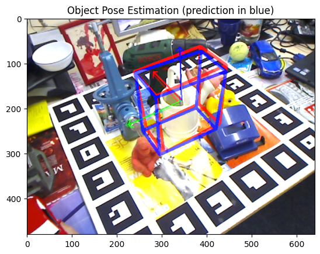
  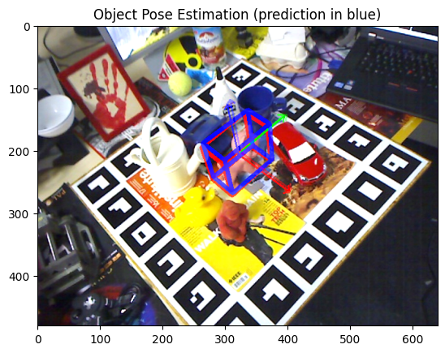
</p>

<p align="center">
  <b>Figure 1:</b> Object 05. &nbsp;&nbsp;
  <b>Figure 2:</b> Object 06.
</p>

<p align="center">
  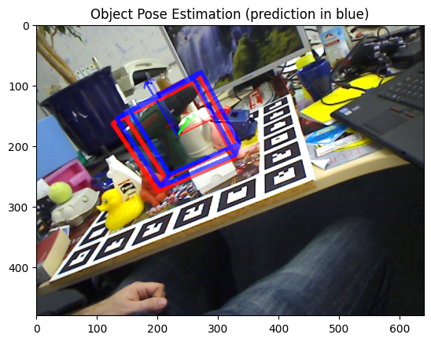
  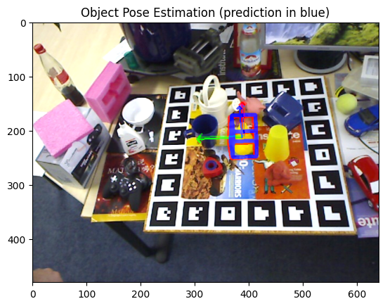
</p>

<p align="center">
  <b>Figure 3:</b> Object 08. &nbsp;&nbsp;
  <b>Figure 4:</b> Object 09.
</p>

<p align="center">
  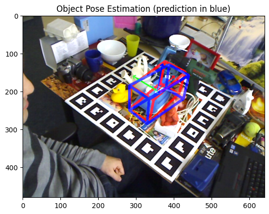
  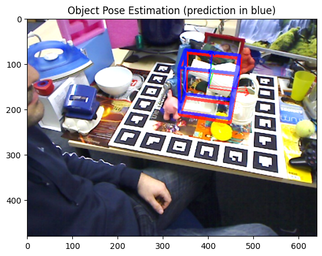
</p>

<p align="center">
  <b>Figure 5:</b> Object 13. &nbsp;&nbsp;
  <b>Figure 6:</b> Object 14.
</p>

#### Evaluation results

**Overall:**

|     Extension      | ADD Score | Accuracy  |
|--------------------|-----------|-----------|
|    RGB-D           | 0.0138    | 80.03%    |
| YOLO + RGB-D       | 0.0144    | 77.03%    |

**Results by object:**


| **Object**         | **Ours**<br>(baseline, RGB) | **Ours**<br>(baseline pipeline, YOLO + RGB) | **Ours**<br>(extension, RGB-D) | **Ours**<br>(extension pipeline, YOLO + RGB-D) |
|--------------------|:---------------------------:|:-------------------------------------------:|:-------------------------------:|:-----------------------------------------------:|
| ape (01)           | 0.0                        | 0.0                                        | 51.1                          | 31.7                                            |
| bench vi. (02)     | 8.8                        | 1.1                                        | 89.6                          | 84.1                                            |
| camera (04)        | 0.0                        | 1.1                                        | 70.0                          | 65.0                                            |
| can (05)           | 2.2                        | 1.7                                        | 81.0                          | 80.5                                            |
| cat (06)           | 1.1                        | 0.0                                        | 79.7                          | 82.0                                            |
| driller (08)       | 3.9                        | 0.5                                        | 90.5                          | **86.5**                                        |
| duck (09)          | 0.0                        | 0.0                                        | 52.1                          | 47.9                                            |
| eggbox (10)        | 13.3                       | 0.5                                        | 100.0                         | **100.0**                                       |
| glue (11)          | 18.0                       | 6.0                                        | 100.0                         | **100.0**                                       |
| hole p. (12)       | 1.1                        | 0.5                                        | 59.7                          | 61.3                                            |
| iron (13)          | 2.9                        | 0.5                                        | 95.4                          | 88.4                                            |
| lamp (14)          | 8.2                        | 1.6                                        | 91.9                          | **92.9**                                        |
| phone (15)         | 2.7                        | 2.1                                        | 81.5                          | 83.2                                            |
| **MEAN**           | **4.8**                    | **1.9**                                    | **80.0**                      | **77.0**                                        |

**Table:** Comparison of 6D pose estimation methods on the LineMOD dataset. Results are reported as accuracy (%) under the ADD(-S) metric.


### Results obtained in autonomous driving dataset

<p align="center">
  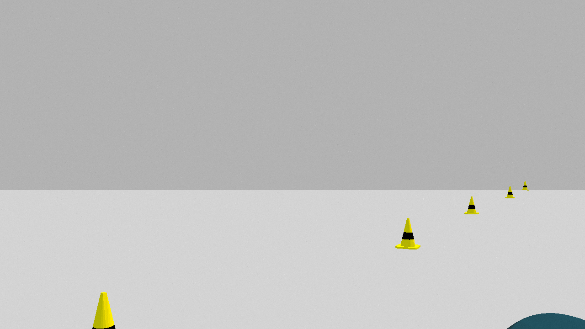
  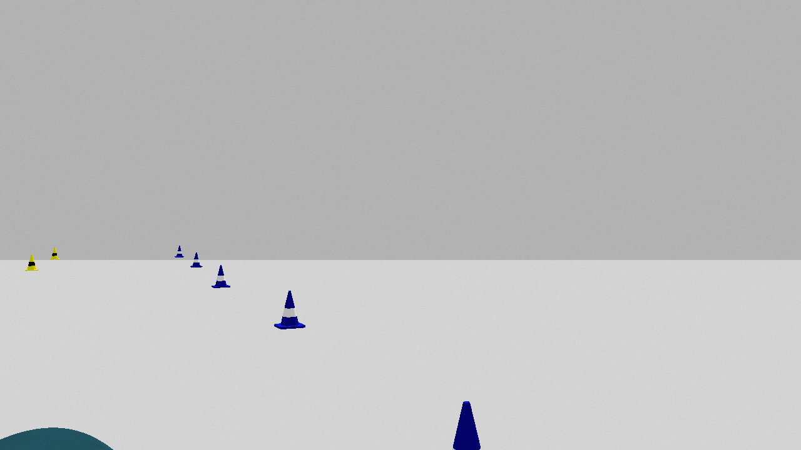
</p>

<p align="center">
  <b>Figure 1:</b> Left camera frame. &nbsp;&nbsp;
  <b>Figure 2:</b> Right camera frame.
</p>

<p align="center">
  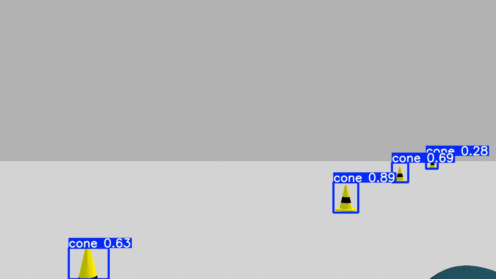
  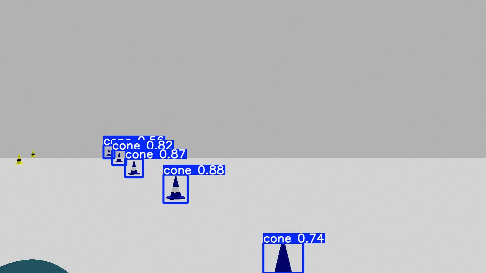
</p>

<p align="center">
  <b>Figure 3:</b> Left camera frame processed by YOLO. &nbsp;&nbsp;
  <b>Figure 4:</b> Right camera frame processed by YOLO.
</p>

<p align="center">
  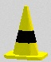
  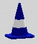
</p>

<p align="center">
  <b>Figure 5:</b> Cropped image of left cone. &nbsp;&nbsp;
  <b>Figure 6:</b> Cropped image of right cone.
</p>

<p align="center">
  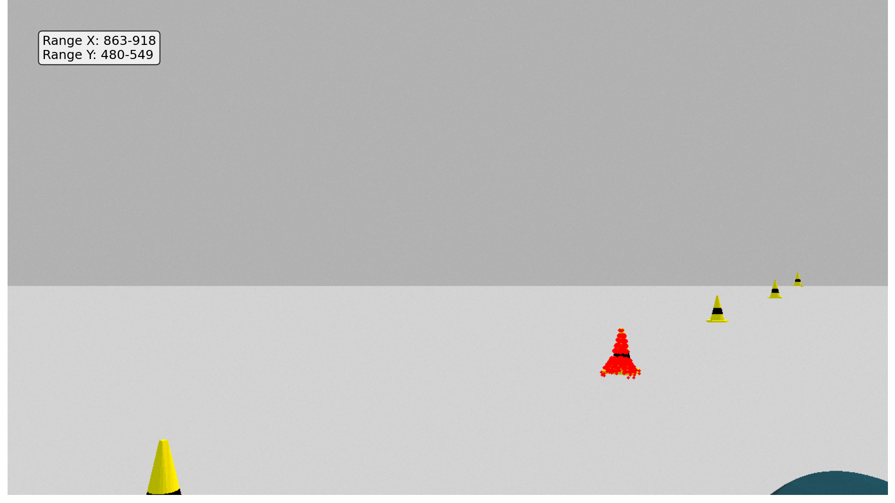
  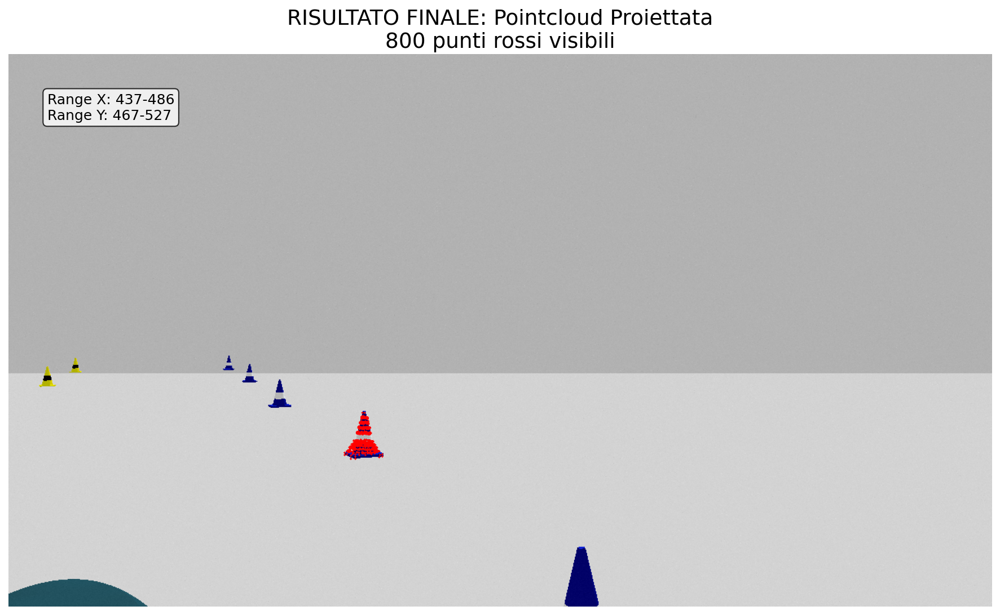
</p>

<p align="center">
  <b>Figure 7:</b> LiDAR pointcloud of the left cone. &nbsp;&nbsp;
  <b>Figure 8:</b> LiDAR pointcloud of the right cone.
</p>

<p align="center">
  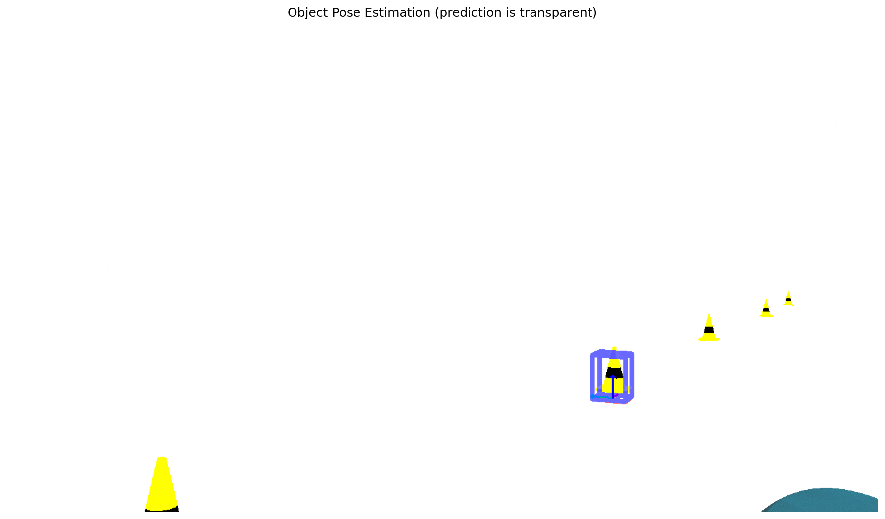
  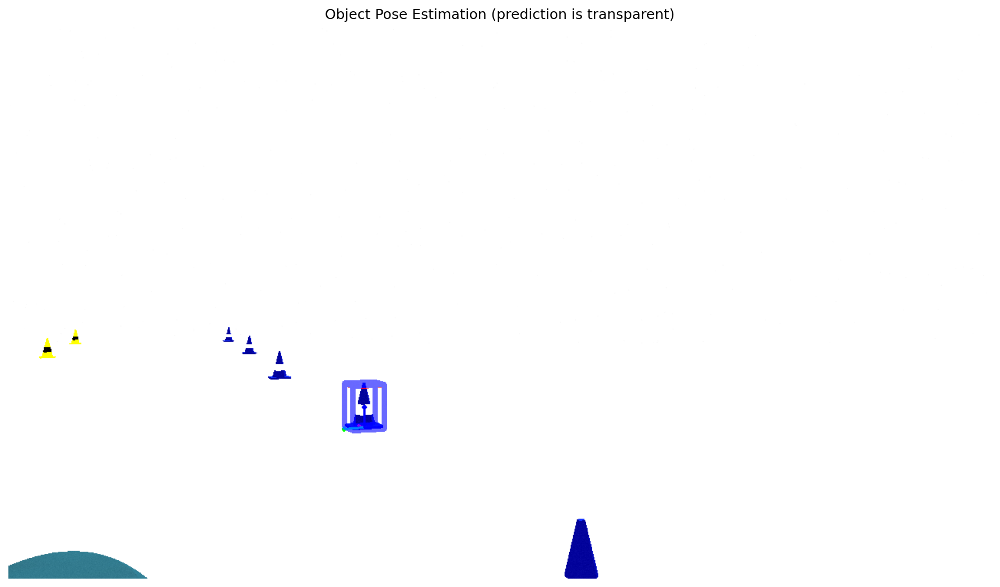
</p>

<p align="center">
  <b>Figure 9:</b> 6D pose estimation of the left cone. &nbsp;&nbsp;
  <b>Figure 10:</b> 6D pose estimation of the right cone.
</p>
